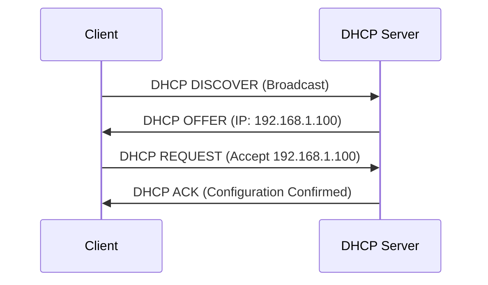
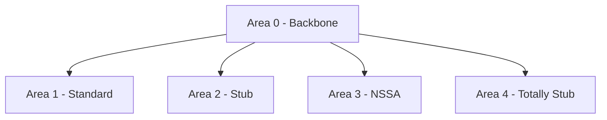
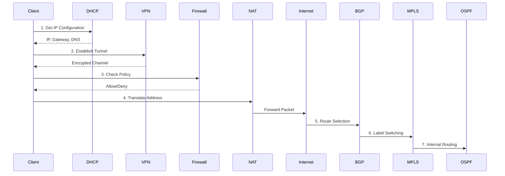

# Deep Dive: What Happens When You Enter a URL in Your Browser

## Table of Contents
1. [URL Parsing and Components](#url-parsing-and-components)
2. [DNS Resolution Process](#dns-resolution-process)
3. [TCP Protocol Deep Dive](#tcp-protocol-deep-dive)
4. [TLS/SSL Protocol Analysis](#tls-ssl-protocol-analysis)
5. [HTTP Protocol Internals](#http-protocol-internals)
6. [Network Layer Operations](#network-layer-operations)
7. [Server-Side Processing](#server-side-processing)
8. [Browser Processing and Rendering](#browser-processing-and-rendering)
9. [Performance Optimization Techniques](#performance-optimization-techniques)
10. [Security Mechanisms](#security-mechanisms)
11. [Network Protocols and Technologies Deep Dive](#network-protocols-and-technologies-deep-dive)

## URL Parsing and Components

### URL Structure Analysis
A URL (Uniform Resource Locator) consists of several components:

```
https://subdomain.example.com:443/path/to/resource?query=value#fragment
```

#### Component Breakdown:
1. **Scheme/Protocol** (`https://`)
   - Defines the protocol for accessing the resource
   - Common schemes: http, https, ftp, mailto, file
   - Protocol determines the rules for data transmission

2. **Subdomain** (`subdomain`)
   - Optional prefix to the domain name
   - Used for organizing and separating different services
   - Examples: www, blog, api

3. **Domain Name** (`example.com`)
   - Second-level domain (example)
   - Top-level domain (.com)
   - Human-readable address of the website

4. **Port** (`:443`)
   - Optional port number
   - Default ports:
     - HTTP: 80
     - HTTPS: 443
     - FTP: 21
     - SSH: 22

5. **Path** (`/path/to/resource`)
   - Location of the resource on the server
   - Hierarchical structure
   - Case-sensitive in most servers

6. **Query Parameters** (`?query=value`)
   - Key-value pairs for additional information
   - Separated by & for multiple parameters
   - Used for:
     - Search parameters
     - Filtering
     - Session tracking
     - Dynamic content generation

7. **Fragment** (`#fragment`)
   - Reference to a specific section of the page
   - Processed client-side only
   - Not sent to the server

### URL Encoding
1. **Character Encoding**
   - Reserved characters must be percent-encoded
   - Space becomes %20
   - Special characters like &, =, ?, # must be encoded
   - UTF-8 characters require special encoding

2. **URL Validation**
   - Length checks (maximum 2048 characters for most browsers)
   - Character set validation
   - Scheme validation
   - Domain name validation

## DNS Resolution Process

### DNS Architecture
1. **DNS Hierarchy**
   ```
   . (Root)
   ├── .com
   │   └── example.com
   │       └── www.example.com
   ├── .org
   ├── .net
   └── ...
   ```

### DNS Record Types
1. **A Record**
   - Maps hostname to IPv4 address
   - Example:
     ```
     example.com.     IN  A     93.184.216.34
     ```

2. **AAAA Record**
   - Maps hostname to IPv6 address
   - Example:
     ```
     example.com.     IN  AAAA  2606:2800:220:1:248:1893:25c8:1946
     ```

3. **CNAME Record**
   - Alias of one name to another
   - Example:
     ```
     www.example.com. IN  CNAME example.com.
     ```

4. **MX Record**
   - Mail exchange servers
   - Example:
     ```
     example.com.     IN  MX    10 mail.example.com.
     ```

5. **NS Record**
   - Nameserver records
   - Example:
     ```
     example.com.     IN  NS    ns1.example.com.
     ```

6. **PTR Record**
   - Reverse DNS lookup
   - Example:
     ```
     34.216.184.93.in-addr.arpa. IN PTR example.com.
     ```

7. **SOA Record**
   - Start of Authority
   - Contains zone information
   - Example:
     ```
     example.com.     IN  SOA   ns1.example.com. admin.example.com. (
                                2023100101 ; serial
                                3600       ; refresh
                                1800       ; retry
                                604800     ; expire
                                86400      ; minimum TTL
                                )
     ```

### DNS Resolution Process
1. **Local DNS Cache Check**
   ```mermaid
   graph TD
      A[Browser DNS Cache] --> B[OS DNS Cache]
      B --> C[Hosts File]
      C --> D[Resolver]
   ```

2. **Recursive Resolution**
   ```mermaid
   graph TD
      A[Local Resolver] --> B[Root Servers]
      B --> C[TLD Servers]
      C --> D[Authoritative Servers]
      D --> E[Final Answer]
   ```

3. **DNS Message Format**
   ```
   +---------------------+
   |        Header      |
   +---------------------+
   |      Question      |
   +---------------------+
   |       Answer       |
   +---------------------+
   |     Authority      |
   +---------------------+
   |     Additional     |
   +---------------------+
   ```

   Header Format:
   ```
   0  1  2  3  4  5  6  7  8  9  10 11 12 13 14 15
   +--+--+--+--+--+--+--+--+--+--+--+--+--+--+--+--+
   |                      ID                       |
   +--+--+--+--+--+--+--+--+--+--+--+--+--+--+--+--+
   |QR|   Opcode  |AA|TC|RD|RA|   Z    |   RCODE   |
   +--+--+--+--+--+--+--+--+--+--+--+--+--+--+--+--+
   |                    QDCOUNT                    |
   +--+--+--+--+--+--+--+--+--+--+--+--+--+--+--+--+
   |                    ANCOUNT                    |
   +--+--+--+--+--+--+--+--+--+--+--+--+--+--+--+--+
   |                    NSCOUNT                    |
   +--+--+--+--+--+--+--+--+--+--+--+--+--+--+--+--+
   |                    ARCOUNT                    |
   +--+--+--+--+--+--+--+--+--+--+--+--+--+--+--+--+
   ```

## TCP Protocol Deep Dive

### TCP Segment Structure
```
0                   1                   2                   3
0 1 2 3 4 5 6 7 8 9 0 1 2 3 4 5 6 7 8 9 0 1 2 3 4 5 6 7 8 9 0 1
+-+-+-+-+-+-+-+-+-+-+-+-+-+-+-+-+-+-+-+-+-+-+-+-+-+-+-+-+-+-+-+-+
|          Source Port          |       Destination Port        |
+-+-+-+-+-+-+-+-+-+-+-+-+-+-+-+-+-+-+-+-+-+-+-+-+-+-+-+-+-+-+-+-+
|                        Sequence Number                        |
+-+-+-+-+-+-+-+-+-+-+-+-+-+-+-+-+-+-+-+-+-+-+-+-+-+-+-+-+-+-+-+-+
|                    Acknowledgment Number                      |
+-+-+-+-+-+-+-+-+-+-+-+-+-+-+-+-+-+-+-+-+-+-+-+-+-+-+-+-+-+-+-+-+
|  Data |           |U|A|P|R|S|F|                               |
| Offset| Reserved  |R|C|S|S|Y|I|            Window             |
|       |           |G|K|H|T|N|N|                               |
+-+-+-+-+-+-+-+-+-+-+-+-+-+-+-+-+-+-+-+-+-+-+-+-+-+-+-+-+-+-+-+-+
|           Checksum            |         Urgent Pointer        |
+-+-+-+-+-+-+-+-+-+-+-+-+-+-+-+-+-+-+-+-+-+-+-+-+-+-+-+-+-+-+-+-+
|                    Options                    |    Padding    |
+-+-+-+-+-+-+-+-+-+-+-+-+-+-+-+-+-+-+-+-+-+-+-+-+-+-+-+-+-+-+-+-+
|                             data                              |
+-+-+-+-+-+-+-+-+-+-+-+-+-+-+-+-+-+-+-+-+-+-+-+-+-+-+-+-+-+-+-+-+
```

### TCP Three-Way Handshake


### TCP Connection States
```
CLOSED
  ↓
LISTEN (Server)
  ↓
SYN_SENT (Client) → SYN_RECEIVED (Server)
  ↓                   ↓
ESTABLISHED ←――――――――――
  ↓
FIN_WAIT_1
  ↓
FIN_WAIT_2
  ↓
TIME_WAIT
  ↓
CLOSED
```

### TCP Flow Control
1. **Sliding Window**
   - Dynamic window size adjustment
   - Flow control mechanism
   - Prevents buffer overflow

2. **Congestion Control**
   - Slow Start
   - Congestion Avoidance
   - Fast Retransmit
   - Fast Recovery

## TLS/SSL Protocol Analysis

### TLS 1.3 Handshake


### TLS Record Protocol
```
+-------------+
| TLS Header  |
+-------------+
| Content     |
| Type        |
+-------------+
| Version     |
+-------------+
| Length      |
+-------------+
| Payload     |
+-------------+
| MAC/Padding |
+-------------+
```

### Cipher Suites
Example TLS 1.3 Cipher Suite:
```
TLS_AES_256_GCM_SHA384
|   |   |   |   |
|   |   |   └── Hash Algorithm
|   |   └────── Mode of Operation
|   └────────── Encryption Algorithm
└────────────── Protocol
```

## HTTP Protocol Internals

### HTTP/1.1 Message Format
```
Request Line or Status Line
Headers
Empty Line
Message Body
```

Example Request:
```http
GET /path/to/resource HTTP/1.1
Host: www.example.com
User-Agent: Mozilla/5.0
Accept: text/html,application/xhtml+xml
Accept-Language: en-US,en;q=0.9
Accept-Encoding: gzip, deflate, br
Connection: keep-alive
```

Example Response:
```http
HTTP/1.1 200 OK
Date: Mon, 23 May 2023 22:38:34 GMT
Content-Type: text/html; charset=UTF-8
Content-Length: 138
Last-Modified: Wed, 08 Jan 2023 23:11:55 GMT
Server: Apache/2.4.37 (Unix)
ETag: "13-438"
Accept-Ranges: bytes
Connection: close

<!DOCTYPE html>
<html>
<head>
    <title>Example</title>
</head>
<body>
    <h1>Hello, World!</h1>
</body>
</html>
```

### HTTP/2 Frame Format
```
+-----------------------------------------------+
|                 Length (24)                    |
+---------------+---------------+---------------+
|   Type (8)    |   Flags (8)  |
+-+-------------+---------------+-------------------------------+
|R|                 Stream Identifier (31)                     |
+=+=============================================================+
|                   Frame Payload (0...)                       ...
+---------------------------------------------------------------+
```

### HTTP Methods
1. **GET**
   - Retrieve resource
   - Idempotent
   - No body in request

2. **POST**
   - Submit data
   - Not idempotent
   - Has body

3. **PUT**
   - Update resource
   - Idempotent
   - Has body

4. **DELETE**
   - Remove resource
   - Idempotent
   - Usually no body

5. **PATCH**
   - Partial update
   - Not idempotent
   - Has body

6. **HEAD**
   - Like GET but no body
   - Idempotent
   - No body

7. **OPTIONS**
   - Get supported methods
   - Idempotent
   - No body

8. **TRACE**
   - Debug request path
   - Idempotent
   - No body

## Network Layer Operations

### IP Packet Structure (IPv4)
```
0                   1                   2                   3
0 1 2 3 4 5 6 7 8 9 0 1 2 3 4 5 6 7 8 9 0 1 2 3 4 5 6 7 8 9 0 1
+-+-+-+-+-+-+-+-+-+-+-+-+-+-+-+-+-+-+-+-+-+-+-+-+-+-+-+-+-+-+-+-+
|Version|  IHL  |Type of Service|          Total Length         |
+-+-+-+-+-+-+-+-+-+-+-+-+-+-+-+-+-+-+-+-+-+-+-+-+-+-+-+-+-+-+-+-+
|         Identification        |Flags|      Fragment Offset    |
+-+-+-+-+-+-+-+-+-+-+-+-+-+-+-+-+-+-+-+-+-+-+-+-+-+-+-+-+-+-+-+-+
|  Time to Live |    Protocol   |         Header Checksum       |
+-+-+-+-+-+-+-+-+-+-+-+-+-+-+-+-+-+-+-+-+-+-+-+-+-+-+-+-+-+-+-+-+
|                       Source Address                          |
+-+-+-+-+-+-+-+-+-+-+-+-+-+-+-+-+-+-+-+-+-+-+-+-+-+-+-+-+-+-+-+-+
|                    Destination Address                        |
+-+-+-+-+-+-+-+-+-+-+-+-+-+-+-+-+-+-+-+-+-+-+-+-+-+-+-+-+-+-+-+-+
|                    Options                    |    Padding    |
+-+-+-+-+-+-+-+-+-+-+-+-+-+-+-+-+-+-+-+-+-+-+-+-+-+-+-+-+-+-+-+-+
```

### Routing Process


### ARP Protocol


## Server-Side Processing

### Web Server Architecture


### Request Processing Pipeline


## Browser Processing and Rendering

### Critical Rendering Path


### Resource Loading


## Performance Optimization Techniques

### Caching Mechanisms
1. **Browser Cache**
   ```
   Cache-Control: public, max-age=31536000
   ETag: "33a64df551425fcc55e4d42a148795d9f25f89d4"
   Last-Modified: Wed, 21 Oct 2015 07:28:00 GMT
   ```

2. **DNS Cache**
   ```
   example.com.     86400   IN      A       93.184.216.34
   ```

3. **CDN Cache**
   ```mermaid
   graph TD
    A[User] --> B[Edge Location]
    B --> C[Regional Cache]
    C --> D[Origin Server]
   ```

### Connection Optimization
1. **TCP Fast Open**
   ```
   TCP Fast Open Cookie Request
   ↓
   TCP Fast Open Cookie
   ↓
   Data + Cookie (subsequent connections)
   ```

2. **HTTP/2 Multiplexing**
   ```
   Stream 1 ------>|
   Stream 2 ------>| Single TCP Connection
   Stream 3 ------>|
   ```

## Security Mechanisms

### TLS Certificate Structure
```
Certificate
├── Version
├── Serial Number
├── Signature Algorithm
├── Issuer
├── Validity Period
├── Subject
├── Subject Public Key Info
│   ├── Algorithm
│   └── Public Key
└── Extensions
    ├── Key Usage
    ├── Extended Key Usage
    ├── Subject Alternative Name
    └── Basic Constraints
```

### HSTS Implementation
```http
Strict-Transport-Security: max-age=31536000; includeSubDomains; preload
```

### Content Security Policy
```http
Content-Security-Policy: default-src 'self';
                        script-src 'self' 'unsafe-inline' 'unsafe-eval';
                        style-src 'self' 'unsafe-inline';
                        img-src 'self' data: https:;
                        connect-src 'self' https://api.example.com;
```

## Network Protocols and Technologies Deep Dive

This section covers the critical networking protocols and technologies that play important roles during the URL processing and general network communication.

### DHCP (Dynamic Host Configuration Protocol)

#### When It Comes Into Play
- Before any network communication starts
- During IP lease renewal
- When connecting to new networks

#### DHCP Process Flow


#### DHCP Configuration Parameters
1. **Basic Network Configuration**
   - IP Address
   - Subnet Mask
   - Default Gateway
   - Lease Duration

2. **Additional Parameters**
   - DNS Servers
   - NTP Servers
   - Domain Name
   - WINS Servers

### NAT (Network Address Translation)

#### Types of NAT
1. **Static NAT**
   ```
   Internal IP: 192.168.1.100 ←→ Public IP: 203.0.113.5 (1:1 mapping)
   ```

2. **Dynamic NAT**
   ```
   Internal IP Pool ←→ Public IP Pool
   192.168.1.0/24 ←→ 203.0.113.0/24
   ```

3. **PAT (Port Address Translation)**
   ```
   Source NAT Table:
   Internal              External
   192.168.1.100:49152 → 203.0.113.5:1024
   192.168.1.101:49152 → 203.0.113.5:1025
   192.168.1.102:49152 → 203.0.113.5:1026
   ```

### VPN (Virtual Private Network)

#### VPN Protocols and Features

1. **IPSec**
   ```
   +----------------+----------------+----------------+
   | IP Header | ESP Header | Encrypted Payload | ESP Trailer |
   +----------------+----------------+----------------+
   ```

2. **OpenVPN**
   - TLS-based encryption
   - TCP/UDP support
   - Perfect Forward Secrecy

3. **WireGuard**
   ```
   Advantages:
   - Smaller codebase
   - Better performance
   - Modern cryptography
   ```

### Firewall

#### Firewall Types and Functions

1. **Packet Filtering Rules Example**
   ```
   Priority   Source          Destination    Port    Action
   1         192.168.1.0/24   *             80,443   ALLOW
   2         *                *             22       DENY
   3         *                *             *        DROP
   ```

2. **Stateful Inspection**
   ```
   Connection Tracking Table:
   Source IP:Port      Dest IP:Port        State
   192.168.1.100:49152 8.8.8.8:53         ESTABLISHED
   192.168.1.101:33456 204.79.197.200:443 NEW
   ```

### BGP (Border Gateway Protocol)

#### BGP Route Selection Process
```
1. Highest Local Preference
   ↓
2. Shortest AS Path
   ↓
3. Lowest MED
   ↓
4. eBGP over iBGP
   ↓
5. Lowest IGP metric
   ↓
6. Lowest Router ID
```

#### BGP Path Attributes
```
Network: 203.0.113.0/24
Path: AS100 AS200 AS300
Next Hop: 192.0.2.1
Local Pref: 100
MED: 10
Origin: IGP
```

### OSPF (Open Shortest Path First)

#### OSPF Area Types


#### LSA Types
1. **Type 1**: Router LSA
2. **Type 2**: Network LSA
3. **Type 3**: Summary LSA
4. **Type 4**: ASBR Summary
5. **Type 5**: External LSA

### MPLS (MultiProtocol Label Switching)

#### MPLS Label Stack
```
+----------------------+
| Top Label (20 bits)  |
+----------------------+
| VPN Label (20 bits)  |
+----------------------+
| IP Packet            |
+----------------------+
```

#### MPLS Operations
1. **PUSH**: Add label
2. **SWAP**: Replace label
3. **POP**: Remove label

### Protocol Integration in URL Processing



### Security Stack
```
Layer 7: Application Firewall
   ↓
Layer 6-5: VPN Encryption
   ↓
Layer 4-3: NAT Translation
   ↓
Layer 3-2: Firewall Rules
```

### Routing Stack
```
External: BGP (Inter-AS)
   ↓
Core: MPLS (Transport)
   ↓
Internal: OSPF (Intra-AS)
```

### Troubleshooting Methodology

1. **Address Assignment Issues**
   - Check DHCP server availability
   - Verify IP address lease
   - Confirm subnet configuration

2. **Connectivity Problems**
   - Test VPN tunnel status
   - Verify NAT translations
   - Check firewall rules

3. **Routing Issues**
   - Validate BGP paths
   - Check MPLS labels
   - Verify OSPF areas

4. **Performance Optimization**
   - Monitor VPN overhead
   - Optimize NAT tables
   - Tune routing protocols

## References and Further Reading

1. RFCs:
   - RFC 1034/1035 (DNS)
   - RFC 793 (TCP)
   - RFC 8446 (TLS 1.3)
   - RFC 7540 (HTTP/2)
   - RFC 7231 (HTTP/1.1)

2. Web Standards:
   - [HTML Living Standard](https://html.spec.whatwg.org/)
   - [CSS Specifications](https://www.w3.org/Style/CSS/specs.en.html)
   - [ECMAScript Specification](https://tc39.es/ecma262/)

3. Security Standards:
   - [OWASP Web Security Testing Guide](https://owasp.org/www-project-web-security-testing-guide/)
   - [Mozilla Web Security Guidelines](https://infosec.mozilla.org/guidelines/web_security)

---

*This document is maintained and updated regularly. Last update: 2024*
